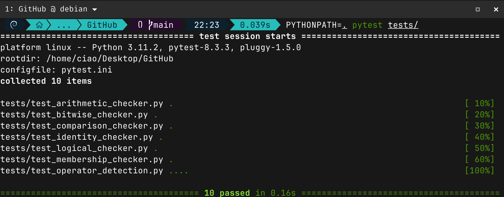

[](https://pypi.org/project/PyGCA/)
[](https://github.com/clintaire/PyGCA/actions)
[](https://pypistats.org/packages/PyGCA)
[](https://github.com/psf/black)
[](https://opensource.org/licenses/MIT)

## PyGCA

**PyGCA** is a Python library designed to detect and analyze operator usage in Python codebases. It supports a variety of operators, including arithmetic, bitwise, comparison, identity, logical, and membership operators. The library offers actionable suggestions for performance improvements, detailed reports on operator misuse, and customizable settings to fit different project needs.


**Key Features**
- **Multi-operator detection**:
  - Arithmetic (` + `, ` - `, ` * `, ` / `, etc)
  - Bitwise (` & `, ` | `, ` ^ `, etc)
  - Comparison (` == `, ` != `, ` > `, etc)
  - Identity (` is `, ` is not `)
  - Logical (` and `, ` or `, ` not `)
  - Membership (` in `, ` not in `)
- **Actionable suggestions** for performance improvements
- **Detailed reporting** on operator misuse
- **Customizable settings** for different project needs

> [!TIP]
> To better understand the __functional__ areas of each operator category and where they overlap, the following  diagram visually represents the __scope__ of PyGCA:

**Go to Installation**
1. Clone The Repository:
```
git clone https://github.com/clintaire/PyGCA.git
```

```
cd PyGCA
```

2. Install Dependencies:
```
pip install -r requirements.txt
```

**Usage**

Run the Operator Analysis
You can analyze any Python script for operator usage with a simple command :

```
python3 -m bot.operator_analysis path/to/your_script.py
```

**Here’s a basic Python script with various operators that PyGCA can analyze:**

```python
    def analyze_example(a, b):
    # Arithmetic operators
    sum_result = a + b
    diff = a - b
    
    # Logical operators
    if a and b:
        return True
    elif a or b:
        return False

    # Bitwise operators
    result = a & b
    return result
```


Run PyGCA and Inspect Output / Basically to inspect the code above
```
python3 -m bot.operator_analysis analyze_example.py
```

The following truth table demonstrates logical operator results and their detection by PyGCA:

| Expression          | Expected Result | Detected Issue |
| ------------------- | --------------- | -------------- |
| True and False      | False           | No issue       |
| False or True       | True            | No issue       |
| True and False      | Data            | No issue       |
| not True            | False           | No issue       |
| a and not b         | Depends on vars | No issue       |
| a & b (bitwise AND) | Depends on bits | Alert!         |


> [!NOTE]
> You can modify PyGCA’s behavior to handle special cases or focus on specific operator categories. To run only the arithmetic or comparison checks, you can adjust configuration files or pass custom flags during execution

### To only check for Arithmetic Operators

```
python3 -m bot.operator_analysis --check-arithmetic path/to/script.py
```

- When running PyGCA on a larger codebase or a real-world project, it’s important to use modular analysis and profiling techniques to measure performance impact. Here’s how to profile the performance:

```python
   import time
   from bot.arithmetic.arithmetic_checker import ArithmeticOperatorChecker
   from bot.utils import set_parents
   import ast

   # Load large source code
   source_code = """
   def large_function():
    x = 1
   """ * 10000  # Replicate a small function 10,000 times

   # Time the performance
   start_time = time.time()
   tree = ast.parse(source_code)
   set_parents(tree)
   checker = ArithmeticOperatorChecker()
   checker.visit(tree)
   end_time = time.time()

   print(f"Analysis completed in {end_time - start_time} seconds")
```
Running the above :top: code will allow you to test PyGCA on __large__ scripts, and the output will help measure its __efficiency__.

# Testing

## To ensure everything is working, you can run _PyGCA’s_ test suite using pytest. This will validate the detection algorithms against various test cases:

```bash
   PYTHONPATH=. pytest tests/
```

## Upon successful execution, the terminal output should pass:

<div style="text-align: center;">
  
</div>


## Contributing

I welcome contributions! If you'd like to contribute to PyGCA, follow these steps:

1. Fork the repository.
2. Create a new branch for your feature or bugfix, replacing `my-new-feature` with a descriptive name: `git checkout -b my-feature-name`
3. Make your changes and commit them: `git commit -am 'Add new feature'`
4. Push the branch: `git push origin my-feature-name`
5. Create a new Pull Request.

Make sure to run the tests with `pytest` and ensure everything is working before submitting your PR.

For more details, see the [Contributing Guide](https://github.com/clintaire/PyGCA/blob/PyGCA/CONTRIBUTING.md).

## How to Follow

Join the community and stay updated with the latest changes to PyGCA by following the repository on GitHub:

- Watch the repository to get notifications for updates.
- Star the repository if you find it useful.
- Follow [Clint Airé](https://github.com/clintaire) for updates on PyGCA and other projects.

## Credits

- Image Credit: [Wikipedia](https://en.wikipedia.org/wiki/Arithmetic)

## LICENSE

Copyright 2024-Present Clint Airé.

The [PyGCA](https://github.com/clintaire/PyGCA) repository is released under the [MIT](https://github.com/clintaire/PyGCA/blob/main/LICENSE) license.
